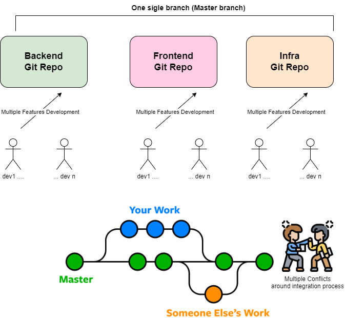

# Introducción a Gitflow: un poco de contexo

GitFlow es una estrategia de branching ampliamente adoptada en el ámbito del desarrollo de software, diseñada para administrar de manera efectiva el ciclo de vida de un proyecto. En su esencia, GitFlow introduce el uso estructurado y significativo de ramas para orquestar el proceso de desarrollo, la gestión de versiones y corrección de errores. Esta estrategia proporciona transparencia y uniformidad gracias a su flujo de trabajo predecible y la práctica de versionado sistemático, lo que facilita la colaboración eficiente entre equipos, la introducción ordenada de nuevas funcionalidades y despliegues o releases con mayor rigor y control. Este espacio te brindará una comprensión de los principios fundamentales del enfoque de Perficient para la integración de GitFlow en nuestros proyectos, junto con las mejores prácticas y los escenarios ideales de implementación.

## ¿Qué es Gitflow?

**Gitflow** es una estrategia de branching que se basa en dos ramas principales: "master" y "develop". En esta metodología, el equipo de desarrollo realiza integraciones continuas de cambios en la rama "develop", mientras que la rama "master" se reserva para las versiones de producción estables. Además, se utilizan ramas específicas, como "feature branches", "release branches" y "hotfix branches", para gestionar el desarrollo de nuevas características, preparar lanzamientos y abordar correcciones de errores críticos de manera ordenada y eficiente.

## ¿Cúando deberías considerar usar Gitflow?
Gitflow es un flujo de trabajo de desarrollo de software que se utiliza especialmente en proyectos con un ciclo de vida largo o en equipos grandes donde se necesita una estructura más formal para la gestión de ramas y versiones.Algunos items a considerar cuando evaluas la posibilidad de usar GitFlow, son los siguientes:

- **Entregas Planificadas y Estables:** Gitflow es ideal cuando se requieren entregas planificadas y estables para las versiones de producción. La rama "develop" actúa como un lugar central para integrar y probar nuevas características antes de ser fusionadas en "master" para su lanzamiento.

- **Gestión de Versiones Controlada:** Si tu proyecto necesita un control estricto de versiones y la capacidad de crear rápidamente lanzamientos estables, Gitflow ofrece un marco estructurado para lograrlo (cuando se mezcla una rama con master, bien sea release o  hotfix).

- **Colaboración en Equipo:** Gitflow fomenta la colaboración en equipo al permitir que los desarrolladores trabajen en paralelo en diferentes características sin interferencias. Cada miembro sabe en qué ramas debe trabajar y cuándo debe fusionar su código. Esto evita conflictos y malentendidos en el proceso de desarrollo.

- **Corrección de Errores Urgentes:** Las hotfix branches permiten abordar problemas críticos en la versión de producción de manera ágil y sin perturbar el desarrollo en curso.

- **Complejidad Adicional:** También es importante conocer que Gitflow puede añadir complejidad al proceso debido a la gestión de múltiples tipos de ramas. Esto puede requerir una planificación y coordinación cuidadosa.Así mismo, es de vital importancia que el equipo se familiarice con la estrategia de branching, por lo que al inicio es fundamental la capacitación técnica del equipo para suavizar la curva de aprendizaje y adaptación.

## Buenas prácticas para utilizar Gitflow de manera exitosa

1. **Nombrar consistentemente las ramas**:
   - Utiliza nombres de ramas descriptivos y consistentes. Por ejemplo, utiliza un prefijo como "feature/" para las feature branches, "release/" para las ramas de lanzamiento y "hotfix/" para las ramas de corrección de errores. Esto facilita la identificación y la organización de las ramas.

2. **Eliminar las ramas temporales**:
   - Después de fusionar una feature branch en "develop" o "master", elimínala para mantener el repositorio limpio y evitar la acumulación de ramas innecesarias.

   - Una vez que se haya completado la rama de release y se haya fusionado en "develop" y "master", elimínala mantener una lista de ramas más limpia.

3. **Utilizar etiquetas de versión**:
   - Utiliza etiquetas de versión para marcar las versiones específicas en "master". Esto facilita el seguimiento de las versiones lanzadas y proporciona una referencia clara de cada versión del software.

4. **Llevar un registro de las ramas**:
   - Documenta las ramas en uso y su estado actual en un lugar accesible para todo el equipo, como un documento de seguimiento o en la descripción del repositorio. Esto ayuda a evitar confusiones sobre el propósito y el estado de las ramas.

5. **Realizar revisiones de código**:
   - Asegúrate de que todas las feature y release branches sean revisadas antes de la fusión. Las revisiones de código son esenciales para mantener la calidad del código y asegurar que cumpla con los estándares del equipo.

6. **Automatizar pruebas y construcciones**:
   - Implementa pipelines de CI/CD (Integración Continua / Entrega Continua) para automatizar las pruebas y las construcciones de tu proyecto. Esto garantiza que el código se someta a pruebas automáticamente antes de fusionarse en las ramas principales y ayuda a evitar problemas de calidad.

7. **Comunicación y capacitación**:
   - Asegúrate de que todos los miembros del equipo comprendan la estrategia Gitflow y estén al tanto de las prácticas recomendadas. La comunicación y la capacitación son fundamentales para garantizar que todos sigan el flujo de trabajo correctamente.

8. **Evaluar la necesidad de Gitflow**:
   - Antes de adoptar Gitflow, evalúa si es la estrategia adecuada para tu proyecto y equipo. Para proyectos más pequeños o equipos no familiarizados, un flujo de trabajo Git más simple podría ser más eficiente.

9.  **Revisar y ajustar según sea necesario**:
    - Periodicamente, revisa el proceso y ajusta las prácticas según las necesidades cambiantes del proyecto. No tengas miedo de realizar mejoras en el flujo de trabajo si notas áreas de ineficiencia.

# Analicemos este caso

Un equipo de desarrolladores de la consultora Perficient trabaja en la construcción de una aplicación web de comercio electrónico para la tienda SportClothes. El equipo está compuesto por roles clave: desarrolladores backend, frontend, ingenieros de infraestructura y testers. Al iniciar el desarrollo, el cliente tenía la necesidad de ver las funcionalidades principales en poco tiempo, por lo que no realizaron un análisis exhaustivo de las posibles estrategias de ramificación (branching). Como resultado, comenzaron el desarrollo utilizando una estrategia de ramificación simple para gestionar su código fuente en Git. Sin embargo, se encontraron con graves problemas que empezaron a afectar la eficiencia y la calidad del producto.

## Problemas con la Estrategia de Branching Simple

El equipo solía trabajar en un solo branch principal llamado "master". Cada vez que alguien necesitaba agregar una nueva función o realizar una corrección de errores, lo hacían directamente en el "master". Esto resultó en varios problemas:

1. **Conflictos Frecuentes**: Con múltiples desarrolladores trabajando simultáneamente en el "master", los conflictos de código se volvieron habituales. Resolver estos conflictos consumía tiempo y a menudo generaba errores.

2. **Falta de Visibilidad**: Era difícil rastrear quién estaba trabajando en qué y en qué estado se encontraba cada función. Esto llevó a una falta de visibilidad y coordinación en el equipo.

3. **Problemas de Despliegue**: La entrega de nuevas características y correcciones de errores se volvía complicada. A menudo, el equipo tenía que deshacer cambios de último minuto o corregir errores en producción.

4. **Pruebas Inadecuadas**: Los testers tenían dificultades para realizar pruebas adecuadas, ya que no tenían una base de código estable para trabajar. Esto resultaba en pruebas de calidad deficientes y errores frecuentes en producción.

## La Implementación de Gitflow

Después de enfrentar estos problemas de manera recurrente, el equipo decidió implementar la metodología Gitflow. Esta estrategia de branching proporciona una estructura más organizada para el flujo de trabajo de desarrollo de software. Aquí está cómo lo hicieron:

1. **Branches 'master' y 'develop'**: Crearon dos branches principales: "master" y "develop". El "master" representaba la versión estable del producto en producción, mientras que el "develop" era la rama de desarrollo continua.

2. **Feature Branches**: Para cada nueva función o tarea, se creó un branch separado llamado "feature/NombreDeLaFuncionalidad". Esto permitía a los desarrolladores trabajar de manera aislada en sus características sin interferir con el código principal.

3. **Release Branches**: Antes de cada versión, se creaba una rama de "release/versión" a partir de "develop". Aquí se realizaban pruebas finales y correcciones de errores menores.

4. **Hotfix Branches**: Para solucionar problemas críticos en producción, se creaban branches de "hotfix" directamente desde "master" y se fusionaban de nuevo en ambas ramas.

## Beneficios y Experiencia con Gitflow

La implementación de Gitflow trajo varios beneficios notables:

1. **Mayor Orden y Claridad**: El equipo pudo ver claramente el estado de desarrollo de cada función y rama. Esto mejoró la coordinación y redujo los conflictos de código.

2. **Entrega Más Rápida y Estable**: Las versiones se volvieron más predecibles y las implementaciones fueron más suaves. El proceso de revisión de código y pruebas mejoró significativamente.

3. **Mejora en la Colaboración**: Los desarrolladores se sintieron más cómodos trabajando en paralelo, ya que tenían branches dedicados para cada función.

4. **Mayor Control**: Los testers pudieron realizar pruebas más exhaustivas en las feature branches, lo que resultó en una mejor calidad del producto final.

En resumen, la implementación de Gitflow permitió que un equipo altamente capacitado superara los problemas de una estrategia de branching simple y mejorara significativamente su flujo de trabajo de desarrollo de software. La organización de branches, la claridad en la gestión de versiones y el control de calidad más sólido fueron los principales beneficios que experimentaron. Esto se convirtió en una referencia valiosa para futuros proyectos y sirvió como un caso de uso convincente para la adopción de Gitflow en la organización.

## Retos de Gitflow
**Desventajas de Gitflow:**

1. **Complejidad y Mayor complejidad en proyectos pequeños:** Gitflow puede resultar complicado, especialmente para equipos pequeños o proyectos simples. La estructura de ramas y las reglas asociadas pueden ser abrumadoras para los principiantes o para aquellos que no estén familiarizados con Git. En proyectos pequeños o equipos reducidos, Gitflow puede parecer innecesariamente complejo y puede dificultar más que ayudar en el proceso de desarrollo.

2. **Overhead de ramas:** Gitflow implica la creación y gestión de múltiples ramas, lo que puede llevar a un alto número de ramas en el repositorio. Esto puede dificultar el seguimiento de las ramas y aumentar la complejidad general del proyecto.

3. **Rigidez:** Gitflow es un flujo de trabajo bastante rígido que puede no ser adecuado para todos los proyectos. No permite una adaptación fácil a cambios en el proceso de desarrollo, lo que puede ser problemático si el equipo necesita flexibilidad.

4. **Aumento en el tiempo de merge:** Debido a la creación de múltiples ramas y al proceso de merge requerido, Gitflow puede aumentar el tiempo necesario para fusionar cambios y resolver conflictos, especialmente en proyectos grandes con numerosos desarrolladores.

5. **Mayor sobrecarga de administración:** Gitflow requiere una administración adicional para garantizar que las ramas se creen y se fusionen de acuerdo con las reglas establecidas. Esto puede aumentar la carga de trabajo del equipo de desarrollo y requerir una mayor atención a los detalles.
   
6. **Optimización para la Integración y Entrega Continua (CI/CD):** Aunque Gitflow no está específicamente diseñado para la Integración Continua (CI) ni la Entrega Continua (CD), es perfectamente capaz de desempeñarse de manera efectiva en entornos de CI/CD. La clave radica en la creación de un proceso de CI/CD sólido en las ramas previas a la rama principal (como `develop` o `feature`).Este proceso implica la automatización de pruebas, construcción y/o despliegue en las ramas de feature y develop. Al implementar estas prácticas, se superan los desafíos asociados, lo que garantiza una integración y entrega ininterrumpidas de software. Esto resulta esencial para alcanzar un desarrollo ágil y una entrega de software confiable.

6. **Mayor complejidad en proyectos pequeños:** En proyectos pequeños o equipos reducidos, Gitflow puede parecer innecesariamente complejo y puede dificultar más que ayudar en el proceso de desarrollo.

Es importante recordar que no existe un flujo de trabajo único que sea adecuado para todos los proyectos. La elección de Gitflow u otro flujo de trabajo debe basarse en las necesidades y las circunstancias específicas de tu equipo y proyecto. Puedes adaptar Gitflow o considerar otras metodologías de desarrollo, como GitLab Flow, GitHub Flow o GitOps, según lo que mejor se adapte a tus requerimientos.

# ¿ Cómo implementar GitFlow ?

https://www.atlassian.com/git/tutorials/comparing-workflows/gitflow-workflow#:~:text=Gitflow%20is%20an%20alternative%20Git,lived%20branches%20and%20larger%20commits.